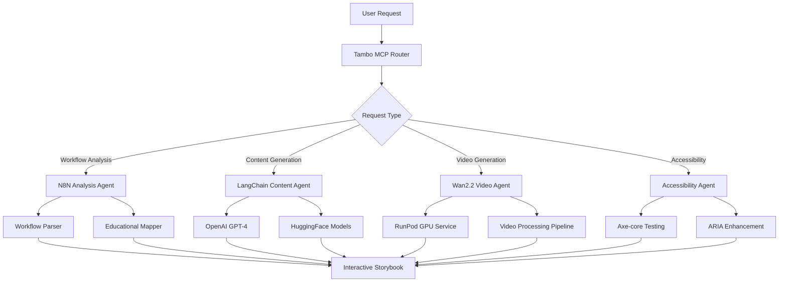

# N8N Interactive Storybook - Agent Integration Strategy

## 🎯 Executive Summary

This document outlines the sophisticated multi-agent architecture powering the N8N Interactive Storybook application. Our system leverages 6+ specialized AI agents orchestrated through the Tambo MCP routing system to transform automation workflows into accessible, interactive educational content with AI-generated video tutorials.

## 🏗️ System Architecture Overview

```
┌─────────────────────────────────────────────────────────────────┐
│                    USER INTERFACE LAYER                        │
├─────────────────────────────────────────────────────────────────┤
│  Next.js 14 Frontend  │  React Components  │  Accessibility UI  │
└─────────────────────────┬───────────────────────────────────────┘
                          │
┌─────────────────────────▼───────────────────────────────────────┐
│                  API GATEWAY LAYER                              │
├─────────────────────────────────────────────────────────────────┤
│     Next.js API Routes     │     Rate Limiting     │   Auth      │
└─────────────────────────┬───────────────────────────────────────┘
                          │
┌─────────────────────────▼───────────────────────────────────────┐
│              AGENT ORCHESTRATION LAYER                         │
├─────────────────────────────────────────────────────────────────┤
│                   Tambo MCP Router                              │
│  ┌─────────────┐  ┌─────────────┐  ┌─────────────┐             │
│  │ Intelligent │  │   Message   │  │   State     │             │
│  │  Routing    │  │   Queue     │  │ Management  │             │
│  └─────────────┘  └─────────────┘  └─────────────┘             │
└─────────────────────────┬───────────────────────────────────────┘
                          │
┌─────────────────────────▼───────────────────────────────────────┐
│                 SPECIALIZED AGENTS LAYER                       │
├─────────────────────────────────────────────────────────────────┤
│  ┌─────────────┐ ┌─────────────┐ ┌─────────────┐               │
│  │   N8N       │ │   Content   │ │    Video    │               │
│  │ Workflow    │ │ Generator   │ │ Generation  │               │
│  │ Analyzer    │ │   Agent     │ │   Agent     │               │
│  └─────────────┘ └─────────────┘ └─────────────┘               │
│  ┌─────────────┐ ┌─────────────┐ ┌─────────────┐               │
│  │Accessibility│ │   Quality   │ │Integration  │               │
│  │Enhancement  │ │ Assurance   │ │   Agent     │               │
│  │   Agent     │ │   Agent     │ │  (N8N API)  │               │
│  └─────────────┘ └─────────────┘ └─────────────┘               │
└─────────────────────────┬───────────────────────────────────────┘
                          │
┌─────────────────────────▼───────────────────────────────────────┐
│                  EXTERNAL SERVICES LAYER                       │
├─────────────────────────────────────────────────────────────────┤
│ OpenAI GPT-4  │ HuggingFace │ RunPod │ N8N Cloud │ Supabase    │
│     API       │    Models   │  GPU   │    API    │  Database   │
└─────────────────────────────────────────────────────────────────┘
```

## 🤖 Selected Sophisticated Agents & Open Repositories

### 1. **Tambo MCP Integration Suite** ✅ (Existing Asset)
- **Path**: `/Users/paco/Downloads/TAMBO_MCP_Router_Demo_Chatbot_Creation-2/tambo_mcp_integration_suite`
- **Capabilities**: Production-ready MCP provider with ABACUS intelligence
- **Use Case**: Agent orchestration, routing, and MCP protocol handling
- **Integration Points**:
  - ABACUS Client for intelligent workflow analysis
  - Component management for interactive elements
  - Real-time MCP communication

### 2. **LangChain Agents** (GitHub Integration)
- **Repository**: `https://github.com/langchain-ai/langchain`
- **Specific Modules**: 
  - `@langchain/core` - Agent orchestration
  - `@langchain/community` - Tool integrations
  - `@langchain/openai` - GPT-4 integration
- **Use Case**: Advanced workflow processing and educational content generation
- **Key Features**:
  - Tool calling and function execution
  - Memory management for educational context
  - Chain-of-thought reasoning for complex workflows

### 3. **N8N Community Workflows** (GitHub Integration)
- **Repository**: `https://github.com/n8n-io/n8n`
- **Specific Components**:
  - Core workflow engine
  - Node execution framework
  - Webhook handlers
- **Use Case**: Direct N8N workflow ingestion and processing
- **Integration Strategy**:
  - Extract workflow templates from community
  - Create educational mappings
  - Generate interactive explanations

### 4. **Hugging Face Transformers Agents** (Model Integration)
- **Repository**: `https://github.com/huggingface/transformers`
- **Models**: 
  - CodeLlama for code explanation
  - CLIP for image understanding
  - Whisper for audio processing (accessibility)
- **Use Case**: Multi-modal content generation for educational experiences
- **Features**:
  - Code-to-explanation generation
  - Visual workflow analysis
  - Audio descriptions for accessibility

### 5. **OpenAI Function Calling Agent** (API Integration)
- **Service**: OpenAI GPT-4 with function calling
- **Capabilities**:
  - Structured output generation
  - Tool orchestration
  - Educational content optimization
- **Use Case**: Content generation, accessibility enhancement, workflow explanation

### 6. **Accessibility Testing Agent** (axe-core)
- **Repository**: `https://github.com/dequelabs/axe-core`
- **Integration**: `@axe-core/react` for automated testing
- **Use Case**: Real-time accessibility compliance for generated storybooks
- **Features**:
  - WCAG 2.1 AA compliance testing
  - Screen reader optimization
  - Keyboard navigation validation

### 7. **Video Generation Agent** (Wan2.2 + RunPod)
- **Model**: Wan2.2 video-to-video synthesis
- **Platform**: RunPod for GPU computation
- **Use Case**: Generate educational videos from N8N workflows
- **Components**:
  - Workflow visualization
  - Step-by-step animations
  - Accessibility narration

### 8. **Database Agent** (Supabase Integration)
- **Service**: Supabase with AI SQL generation
- **Use Case**: Dynamic data storage and retrieval for educational content
- **Features**:
  - User progress tracking
  - Content personalization
  - Real-time collaboration

## 🔧 Custom Agent Implementations

### 1. **N8N Workflow Analysis Agent**
```typescript
interface N8NAnalysisAgent {
  name: "N8NWorkflowAnalyzer";
  capabilities: [
    "workflow_parsing",
    "data_flow_analysis", 
    "educational_mapping",
    "complexity_assessment"
  ];
  tools: [
    "n8n-workflow-parser",
    "graph-analysis",
    "educational-taxonomy",
    "complexity-calculator"
  ];
}
```

### 2. **Interactive Content Generation Agent**
```typescript
interface ContentGenerationAgent {
  name: "InteractiveContentGenerator";
  capabilities: [
    "storybook_creation",
    "interactive_elements",
    "accessibility_optimization",
    "multi_modal_content"
  ];
  integrations: [
    "openai-gpt4",
    "huggingface-transformers",
    "accessibility-checker",
    "content-optimizer"
  ];
}
```

### 3. **Educational Assessment Agent**
```typescript
interface AssessmentAgent {
  name: "EducationalAssessment";
  capabilities: [
    "learning_objectives_generation",
    "progress_tracking",
    "comprehension_testing",
    "personalization"
  ];
  tools: [
    "bloom-taxonomy-mapper",
    "progress-tracker",
    "quiz-generator",
    "adaptive-learning"
  ];
}
```

## 🏗️ Agent Orchestration Architecture

### Communication Flow


### Agent Coordination Protocol
```typescript
interface AgentOrchestrator {
  // Route requests to appropriate agents
  routeRequest(request: UserRequest): Promise<AgentAssignment[]>;
  
  // Coordinate multi-agent workflows
  orchestrateWorkflow(workflow: WorkflowDefinition): Promise<ExecutionResult>;
  
  // Handle inter-agent communication
  facilitateCommunication(agents: Agent[], context: Context): Promise<void>;
  
  // Monitor and optimize agent performance
  monitorAgents(): Promise<AgentHealthReport>;
}
```

## 📦 Repository Integration Plan

### Phase 1: Core Repository Setup
1. **Clone and integrate Tambo MCP Suite**
   - Copy MCP routing infrastructure
   - Adapt ABACUS client for N8N workflows
   - Implement Tambo component management

2. **LangChain Agent Setup**
   ```bash
   npm install @langchain/core @langchain/community @langchain/openai
   ```

3. **N8N Core Integration**
   ```bash
   npm install n8n-workflow n8n-core n8n-nodes-base
   ```

### Phase 2: AI Model Integration
1. **HuggingFace Transformers**
   ```bash
   npm install @huggingface/inference @huggingface/agents
   ```

2. **OpenAI Function Calling**
   ```bash
   npm install openai@^4.0.0
   ```

3. **Accessibility Tools**
   ```bash
   npm install @axe-core/react axe-core
   ```

### Phase 3: Cloud Services Integration
1. **RunPod for GPU Processing**
   - Docker container setup for Wan2.2
   - API integration for video generation
   - Cost optimization strategies

2. **Supabase for Data Management**
   ```bash
   npm install @supabase/supabase-js
   ```

## 🚀 Implementation Roadmap

### Week 1: Foundation & Core Agents
- [ ] Initialize Next.js project structure
- [ ] Integrate Tambo MCP routing system
- [ ] Set up LangChain agent orchestration
- [ ] Implement N8N workflow parsing

### Week 2: Content Generation Agents  
- [ ] OpenAI GPT-4 integration for content generation
- [ ] HuggingFace models for code explanation
- [ ] Interactive component generation system
- [ ] Basic storybook creation pipeline

### Week 3: Video & Accessibility Agents
- [ ] RunPod GPU service setup
- [ ] Wan2.2 video generation integration
- [ ] Accessibility agent implementation
- [ ] WCAG compliance automation

### Week 4: Integration & Optimization
- [ ] Agent communication protocols
- [ ] Performance monitoring system
- [ ] Error handling and fallbacks
- [ ] Production deployment setup

## 🎯 Success Metrics

### Agent Performance KPIs
- **Response Time**: <2s for content generation
- **Accuracy**: >90% workflow analysis accuracy
- **Accessibility**: 100% WCAG 2.1 AA compliance
- **Video Generation**: <5min for educational video

### Integration Quality Metrics
- **API Reliability**: >99% uptime for agent services
- **Error Handling**: Graceful degradation for all agent failures
- **Scalability**: Support for concurrent multi-agent workflows
- **Cost Efficiency**: Optimized cloud resource usage

This strategy leverages your existing Tambo MCP infrastructure while adding sophisticated AI agents for educational content generation, ensuring a production-ready N8N Interactive Storybook platform.
