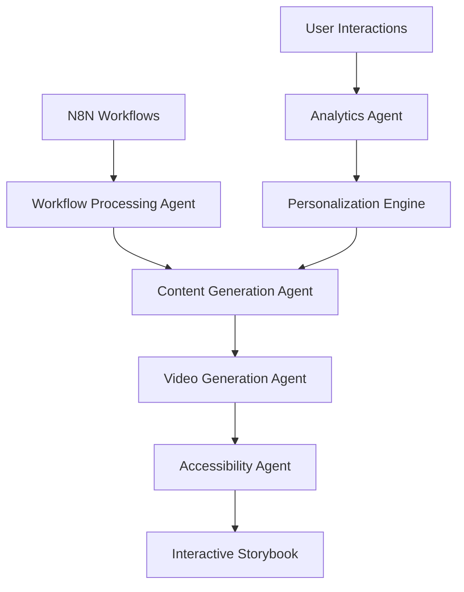

# N8N Interactive Storybook - BMAD Strategic Plan

## 🎯 Business (B) - Value Proposition & Market Strategy

### Core Value Proposition
Transform complex N8N automation workflows into interactive, accessible educational experiences that make learning visual, engaging, and inclusive.

### Target Markets
1. **Educational Institutions**
   - Universities teaching automation/programming
   - K-12 schools with STEM programs
   - Online learning platforms

2. **Accessibility-First Learning**
   - Deaf and hard-of-hearing students
   - Visual learners with learning disabilities
   - Non-native speakers needing visual aids

3. **Corporate Training**
   - Companies teaching internal automation processes
   - Onboarding programs for technical teams
   - Process documentation and training

### Business Model
- **Freemium SaaS**: Basic storybook creation free, advanced features paid
- **Enterprise Licensing**: Custom deployments for organizations
- **Content Marketplace**: User-generated educational content with revenue sharing

### Success Metrics
- User engagement: >70% completion rate for storybooks
- Accessibility compliance: 100% WCAG 2.1 AA compliance
- Time-to-value: <10 minutes from N8N workflow to interactive storybook

## 🧠 Model (M) - AI/Agent Architecture & Data Strategy

### Multi-Agent Orchestration System

#### 1. Content Generation Agent (OpenAI GPT-4)
```typescript
interface ContentAgent {
  workflow_analysis: (n8nWorkflow: N8NWorkflow) => EducationalContent;
  story_generation: (content: EducationalContent) => InteractiveStory;
  accessibility_optimization: (story: InteractiveStory) => AccessibleStory;
}
```

#### 2. Video Generation Agent (Wan2.2 Integration)
```typescript
interface VideoAgent {
  concept_to_video: (concept: string) => VideoAsset;
  workflow_visualization: (workflow: N8NWorkflow) => AnimatedDiagram;
  accessibility_narration: (content: string) => AudioDescription;
}
```

#### 3. Workflow Processing Agent (N8N Integration)
```typescript
interface WorkflowAgent {
  workflow_ingestion: (source: N8NSource) => ProcessedWorkflow;
  data_flow_analysis: (workflow: ProcessedWorkflow) => DataFlowMap;
  step_extraction: (workflow: ProcessedWorkflow) => LearningSteps[];
}
```

#### 4. Accessibility Agent (Custom)
```typescript
interface AccessibilityAgent {
  screen_reader_optimization: (content: any) => ARIACompliantContent;
  visual_description_generation: (media: MediaAsset) => VisualDescription;
  keyboard_navigation_enhancement: (ui: UIComponent) => KeyboardAccessible;
}
```

#### 5. Deployment Orchestration Agent (DevOps)
```typescript
interface DeploymentAgent {
  infrastructure_provisioning: (config: DeployConfig) => InfrastructureState;
  monitoring_setup: (app: Application) => MonitoringConfig;
  scaling_automation: (metrics: Metrics) => ScalingActions;
}
```

### MCP (Model Context Protocol) Integration
- **Tambo MCP Integration Suite**: Leverage existing MCP router for agent communication
- **Custom MCPs**: Build domain-specific MCPs for N8N workflow processing
- **Agent Coordination Protocol**: Implement message passing between agents

### Data Strategy


## 🏗️ Architecture (A) - Technical Implementation

### Frontend Architecture (Next.js 14 + TypeScript)
```
src/
├── components/
│   ├── storybook/
│   │   ├── InteractivePlayer.tsx
│   │   ├── ProgressTracker.tsx
│   │   └── AccessibilityControls.tsx
│   ├── workflow/
│   │   ├── WorkflowVisualizer.tsx
│   │   └── StepSimulator.tsx
│   └── agents/
│       ├── AgentOrchestrator.tsx
│       └── AgentStatus.tsx
├── services/
│   ├── agents/
│   │   ├── ContentGenerationService.ts
│   │   ├── VideoGenerationService.ts
│   │   ├── WorkflowProcessingService.ts
│   │   ├── AccessibilityService.ts
│   │   └── DeploymentService.ts
│   ├── n8n/
│   │   └── N8NIntegrationService.ts
│   └── mcp/
│       └── MCPRouterService.ts
├── pages/api/
│   ├── agents/
│   ├── n8n/
│   └── health/
└── lib/
    ├── agents/
    ├── utils/
    └── types/
```

### Backend Services Architecture
1. **Agent Orchestration Layer**
   - Message queue system (Redis)
   - Agent lifecycle management
   - Inter-agent communication protocols

2. **N8N Integration Layer**
   - Webhook receivers
   - Workflow polling service
   - Data transformation pipeline

3. **Content Processing Pipeline**
   - Video generation queue
   - Content optimization service
   - Accessibility enhancement service

### Database Schema (Supabase)
```sql
-- Core tables
CREATE TABLE workflows (
    id UUID PRIMARY KEY,
    n8n_workflow_id TEXT,
    name TEXT,
    description TEXT,
    processed_content JSONB,
    created_at TIMESTAMP
);

CREATE TABLE storybooks (
    id UUID PRIMARY KEY,
    workflow_id UUID REFERENCES workflows(id),
    content JSONB,
    video_assets TEXT[],
    accessibility_features JSONB,
    created_at TIMESTAMP
);

-- Agent tracking
CREATE TABLE agent_tasks (
    id UUID PRIMARY KEY,
    agent_type TEXT,
    task_data JSONB,
    status TEXT,
    result JSONB,
    created_at TIMESTAMP
);
```

### Tech Stack
- **Frontend**: Next.js 14, TypeScript, Tailwind CSS, Framer Motion
- **Backend**: Node.js, Express, Redis, PostgreSQL (Supabase)
- **AI/Agents**: OpenAI API, Custom MCP implementations
- **Video**: Wan2.2 models, FFmpeg processing
- **Deployment**: Docker, Kubernetes, Cloud Run

## 🚀 Deployment (D) - Infrastructure & Operations

### Multi-Cloud Strategy

#### Primary: Google Cloud Platform
```yaml
# kubernetes/deployment.yaml
apiVersion: apps/v1
kind: Deployment
metadata:
  name: n8n-storybook-app
spec:
  replicas: 3
  selector:
    matchLabels:
      app: n8n-storybook
  template:
    spec:
      containers:
      - name: app
        image: gcr.io/project/n8n-storybook:latest
        ports:
        - containerPort: 3000
        env:
        - name: DATABASE_URL
          valueFrom:
            secretKeyRef:
              name: app-secrets
              key: database-url
```

#### Secondary: RunPod (GPU-intensive video generation)
```dockerfile
# RunPod deployment for video generation
FROM runpod/pytorch:2.1.0-py3.10-cuda11.8.0-devel

WORKDIR /app
COPY requirements.txt .
RUN pip install -r requirements.txt

COPY src/ ./src/
EXPOSE 8000

CMD ["python", "src/video_generation_service.py"]
```

#### Development: Local + Google Colab
```python
# Google Colab integration for development
import os
from google.colab import drive
drive.mount('/content/drive')

# Install dependencies and run development server
!cd /content/drive/MyDrive/n8n-storybook && npm install
!cd /content/drive/MyDrive/n8n-storybook && npm run dev
```

### CI/CD Pipeline (GitHub Actions)
```yaml
name: Deploy N8N Storybook
on:
  push:
    branches: [main]

jobs:
  test:
    runs-on: ubuntu-latest
    steps:
      - uses: actions/checkout@v3
      - name: Run tests
        run: npm test
      - name: Test agent integrations
        run: npm run test:agents

  deploy:
    needs: test
    runs-on: ubuntu-latest
    steps:
      - name: Deploy to Cloud Run
        uses: google-github-actions/deploy-cloudrun@v1
        with:
          service: n8n-storybook
          image: gcr.io/project/n8n-storybook:${{ github.sha }}
```

### Monitoring & Observability
- **Application Monitoring**: Datadog, custom agent performance metrics
- **Error Tracking**: Sentry with agent-specific error contexts
- **Performance**: Lighthouse CI, Core Web Vitals tracking
- **Accessibility**: Automated WCAG compliance testing

### Security
- **Agent Security**: Sandboxed execution environments
- **API Security**: Rate limiting, authentication, input validation
- **Data Privacy**: GDPR compliance, user data encryption
- **Infrastructure**: VPC, security groups, secret management

## 📋 Implementation Roadmap

### Phase 1: Foundation (Weeks 1-2)
- [ ] Set up Next.js project with TypeScript
- [ ] Integrate basic agent orchestration system
- [ ] Implement N8N API connection
- [ ] Create core database schema

### Phase 2: Agent Integration (Weeks 3-4)
- [ ] Implement Content Generation Agent
- [ ] Integrate Video Generation Agent
- [ ] Build Workflow Processing Agent
- [ ] Add Accessibility Agent

### Phase 3: Interactive Features (Weeks 5-6)
- [ ] Develop storybook player
- [ ] Create workflow simulator
- [ ] Implement progress tracking
- [ ] Add accessibility controls

### Phase 4: Deployment (Weeks 7-8)
- [ ] Set up Cloud infrastructure
- [ ] Implement CI/CD pipeline
- [ ] Configure monitoring systems
- [ ] Launch production environment

## 🎯 Success Criteria

### Technical KPIs
- **Performance**: <2s page load time, >95% uptime
- **Accessibility**: 100% WCAG 2.1 AA compliance
- **Agent Efficiency**: <30s workflow processing time
- **Video Generation**: <5min for standard educational video

### User Experience KPIs
- **Engagement**: >70% storybook completion rate
- **Satisfaction**: >4.5/5 user rating
- **Learning Effectiveness**: >80% comprehension improvement
- **Accessibility Usage**: >25% users utilize accessibility features

### Business KPIs
- **Adoption**: 1000+ active users in first 6 months
- **Content Creation**: 500+ storybooks generated monthly
- **Revenue**: $50k ARR by month 12
- **Market Expansion**: 3+ enterprise clients by month 18

---

## 🔧 Sophisticated Agents & Open Repos Integration

### Selected Repositories & Agents

1. **Tambo MCP Integration Suite** (Existing)
   - Path: `/Users/paco/Downloads/TAMBO_MCP_Router_Demo_Chatbot_Creation-2/tambo_mcp_integration_suite`
   - Use: Agent coordination and MCP routing

2. **N8N Community Workflows** (GitHub)
   - Repo: `https://github.com/n8n-io/n8n`
   - Use: Workflow templates and integration patterns

3. **LangChain Agents** (GitHub)
   - Repo: `https://github.com/langchain-ai/langchain`
   - Use: Advanced agent orchestration and tool calling

4. **Wan2.2 Video Generation** (Hugging Face)
   - Model: `video-to-video-synthesis`
   - Use: Educational video content generation

5. **Accessibility Testing Agent** (axe-core)
   - Repo: `https://github.com/dequelabs/axe-core`
   - Use: Automated accessibility compliance testing

This plan provides a comprehensive roadmap for building and deploying your N8N Interactive Storybook application with sophisticated agent integration and production-ready infrastructure.
